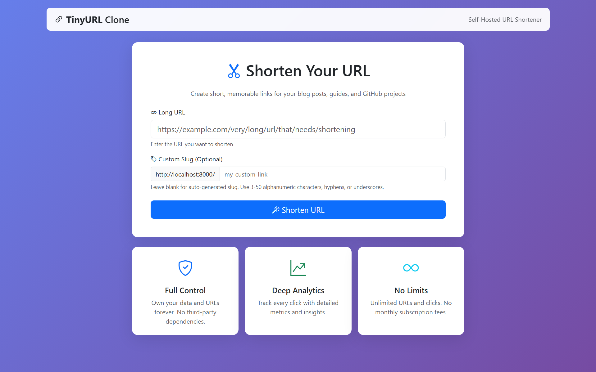
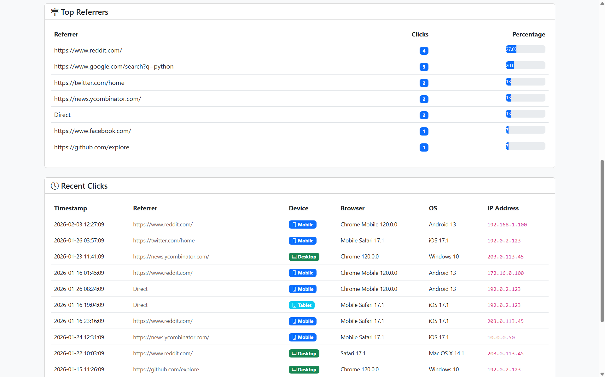

# TinyURL Clone - Self-Hosted URL Shortener

A complete, self-hosted URL shortener built with FastAPI, Bootstrap 5, and SQLite. Track analytics, create custom slugs, and own your data.

If these scripts were useful to you, consider donating to support the Developer Service Blog: https://buy.stripe.com/bIYdTrggi5lZamkdQW


_Simple interface, powerful analytics - build your own URL shortener in a weekend_

Some screenshots:




## Features

### ✅ Currently Implemented

- 🔗 **URL Shortening**: Auto-generated 6-character base62 slugs (56.8B capacity)
- 🎯 **Custom Slugs**: Branded links with validation and reserved slug protection
- 📊 **Analytics Dashboard**: Track clicks, unique visitors, device types, referrers
- 📈 **Real-time Charts**: Time-series line chart and device breakdown pie chart
- 📱 **Responsive UI**: Beautiful Bootstrap 5 interface with icons
- 💾 **SQLite Database**: Zero-config, file-based database with SQLAlchemy ORM
- 🚀 **Fast & Lightweight**: Built with FastAPI for async performance
- 🔄 **URL Expiration**: Support for temporary campaigns (database field ready)
- 🧪 **Test Suite**: Comprehensive tests for core functionality
- 🐳 **Docker Ready**: Dockerfile and docker-compose.yml included

### 💡 Potential Enhancements

See the "Contributing" section below for ideas to extend functionality.

## Quick Start

### Prerequisites

- Python 3.11 or higher (tested with 3.11)
- pip (Python package manager)
- Git (for cloning the repository)

### Installation

1. Clone the repository or download the files

2. Install dependencies:

```bash
pip install -r requirements.txt
```

3. Run the application:

**Option A - Using the run script (Recommended for Windows):**

```bash
python run.py
```

**Option B - Using uvicorn directly:**

```bash
uvicorn main:app --reload --host 0.0.0.0 --port 8000
```

**Option C - Using main.py:**

```bash
python main.py
```

4. Open your browser and navigate to:

```
http://localhost:8000
```

That's it! The database will be created automatically on first run.

#### Windows-Specific Notes

If you encounter multiprocessing errors on Windows:

- Use `python run.py` (recommended) instead of `python main.py`
- Ensure `watchfiles` is installed (included in requirements.txt)
- Python 3.11+ required

If auto-reload still doesn't work, run without reload:

```bash
uvicorn main:app --host 0.0.0.0 --port 8000
```

## Usage

### Creating Short URLs

1. **Homepage**: Visit `http://localhost:8000`
2. **Enter URL**: Paste your long URL
3. **Optional**: Add a custom slug (e.g., "my-blog-post")
4. **Click**: "Shorten URL" button
5. **Copy**: Your short URL is ready!

### Viewing Analytics

- Click "View Stats" on any shortened URL
- Or visit: `http://localhost:8000/stats/{slug}`

Analytics include:

- Total clicks
- Unique visitors
- Average clicks per day
- Click trends over time
- Device type breakdown (mobile, desktop, tablet)
- Top referrers
- Recent click history with browser/OS details

### API Endpoints

#### Create Short URL

```bash
curl -X POST "http://localhost:8000/shorten" \
  -H "Content-Type: application/x-www-form-urlencoded" \
  -d "long_url=https://example.com/very/long/url"
```

Response:

```json
{
  "short_url": "http://localhost:8000/000001",
  "slug": "000001",
  "long_url": "https://example.com/very/long/url"
}
```

With custom slug:

```bash
curl -X POST "http://localhost:8000/shorten" \
  -H "Content-Type: application/x-www-form-urlencoded" \
  -d "long_url=https://example.com&custom_slug=my-link"
```

#### Access Short URL

```bash
curl -L "http://localhost:8000/000001"
# Redirects to the original URL with 302 status
```

#### View Stats

```bash
# Returns HTML analytics dashboard
curl "http://localhost:8000/stats/000001"
```

**Note**: Additional API endpoints (list, delete, health check) can be easily added by extending `main.py`.

## Project Structure

```
.
├── main.py              # FastAPI application & routes
├── models.py            # SQLAlchemy database models
├── database.py          # Database configuration
├── utils.py             # Helper functions (base62, validation, user-agent parsing)
├── requirements.txt     # Python dependencies
├── Dockerfile           # Docker configuration
├── docker-compose.yml   # Docker Compose setup
├── run.py              # Helper script for Windows users
├── test.py             # Test suite
├── templates/           # Jinja2 HTML templates
│   ├── index.html      # Homepage with URL shortener
│   └── stats.html      # Analytics dashboard with charts
├── data/               # Data directory (created on first run)
│   └── urls.db         # SQLite database
├── article.md          # Detailed article about building this project
└── README.md           # This file
```

## How It Works

### Base62 Encoding

The application uses base62 encoding to convert database IDs into short slugs, padded to 6 characters:

- **1** → "000001"
- **100** → "0001Cv"
- **1,000,000** → "004C92"
- **56.8 billion** possible URLs with 6 characters

This guarantees:

- ✅ Zero collisions (each ID = unique slug)
- ✅ Consistent length (6 characters)
- ✅ Predictable growth
- ✅ Reversible (slug → ID for fast lookups)
- ✅ Error handling for invalid slugs

### Custom Slugs

Custom slugs are validated and checked for uniqueness:

- 3-50 characters
- Alphanumeric + hyphens + underscores
- Automatically normalized to lowercase
- Reserved slugs blocked (stats, shorten, admin, login, logout)

### Analytics Tracking

Every redirect captures:

- Timestamp
- Referrer URL
- User agent (parsed for device, browser, OS)
- IP address
- Geographic data (placeholder for GeoIP integration)

## Configuration

### Database

By default, uses SQLite with file `urls.db` in the project directory.

To change database location, use environment variable or edit `database.py`:

```bash
# Via environment variable
export DATABASE_URL="sqlite:///./data/urls.db"

# Or edit database.py
DATABASE_URL = os.getenv("DATABASE_URL", "sqlite:///./your_custom_path.db")
```

### Server Settings

To change host/port, edit `main.py`:

```python
uvicorn.run(
    "main:app",
    host="0.0.0.0",  # Listen on all interfaces
    port=8000,       # Change port here
    reload=True      # Auto-reload on code changes
)
```

## Deployment

### Docker

Build and run with Docker:

```bash
# Build the image
docker build -t tinyurl-clone .

# Run with volume mount for database persistence
docker run -p 8000:8000 -v $(pwd)/data:/app/data tinyurl-clone
```

Or use docker-compose:

```bash
docker-compose up
```

The `docker-compose.yml` includes:

- Volume mounts for database and templates (hot-reload)
- Environment variable configuration
- Health checks
- Automatic restart policy

### Production Considerations

1. **HTTPS**: Use a reverse proxy (nginx, Caddy) with Let's Encrypt
2. **Rate Limiting**: Add `slowapi` for abuse prevention (10 requests/minute recommended)
3. **URL Validation**: Maintain a blocklist of malicious domains
4. **Database Backups**: Automate regular SQLite backups
5. **Monitor Disk Space**: Analytics data grows over time
6. **PostgreSQL**: Consider upgrading for >100 writes/second or distributed deployments
7. **Authentication**: Add API keys or user authentication for private use
8. **Reserved Slugs**: Already implemented (stats, shorten, admin, etc.)

## Customization

### Change Slug Length

Edit `utils.py` to control slug length:

```python
def encode_id(num: int, min_length: int = 6) -> str:
    # Change min_length to 4, 5, 7, etc.
    # Default is 6 characters (56.8 billion URLs)
```

### Add URL Expiration

URLs already support expiration via `expires_at` field. Add UI to set this when creating URLs.

### Block Malicious Domains

Add domain blacklist in `utils.py`:

```python
BLOCKED_DOMAINS = {"malware.com", "spam.net"}

def validate_url(url: str) -> bool:
    parsed = urlparse(url)
    if parsed.netloc in BLOCKED_DOMAINS:
        return False
    # existing validation...
```

## Tech Stack

- **FastAPI**: Modern, fast web framework with async support
- **SQLAlchemy**: ORM for database operations with relationship management
- **SQLite**: Lightweight, file-based database (56.8B URL capacity)
- **Jinja2**: Template engine for server-side rendering
- **Bootstrap 5**: Responsive UI framework with icons
- **Chart.js**: Beautiful analytics visualizations (line & pie charts)
- **user-agents**: Parse user agent strings for device detection
- **uvicorn**: ASGI server for production deployment

## License

MIT License - feel free to use for personal or commercial projects!

## Contributing

Contributions welcome! Some enhancement ideas:

- [ ] **Rate Limiting**: Implement `slowapi` for request throttling
- [ ] **GeoIP Integration**: Add country/city tracking using `geoip2`
- [ ] **QR Code Generation**: Generate QR codes for short URLs
- [ ] **Bulk Operations**: Import/export URLs in CSV/JSON
- [ ] **Custom Domains**: Support multiple short domains
- [ ] **Link Expiration UI**: Frontend for setting expiration dates
- [ ] **Password Protection**: Add password-protected links
- [ ] **API Key Auth**: Secure API access with keys
- [ ] **URL Preview**: Show preview before redirect (safety feature)
- [ ] **Browser Extension**: Chrome/Firefox extension for quick shortening
- [ ] **REST API**: Full CRUD API for URLs (list, delete, update)
- [ ] **Analytics Export**: Export click data to CSV/JSON

## Support

For issues or questions, please open an issue on GitHub.

---

**Made with ❤️ using FastAPI, Bootstrap, and SQLite**
